# Results from the survey

## 0. Hvor bor du? (%)

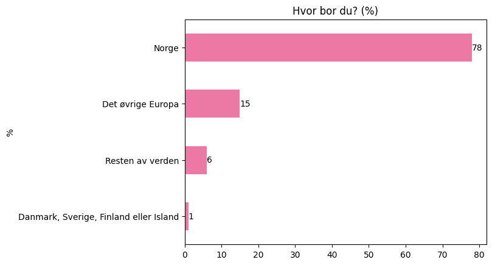


## 1. Hvor gammel er du?

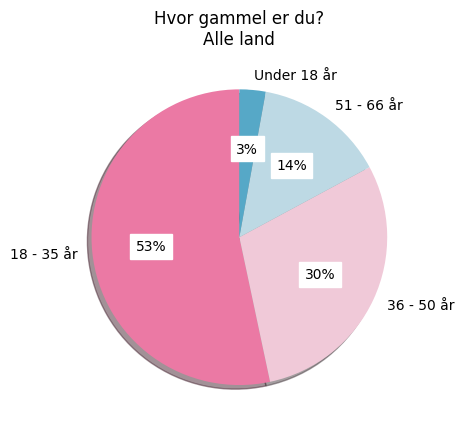

```
             alder
alder             
18 - 35 år      56
36 - 50 år      31
51 - 66 år      15
Under 18 år      3
```

## 2. Hva er ditt kjønn?

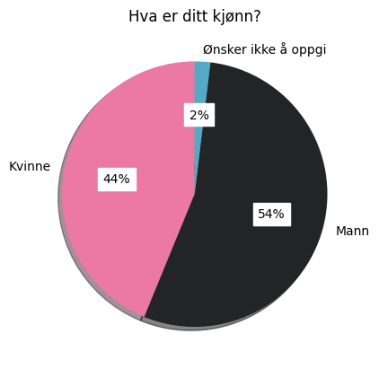

```
                     kjonn
kjonn                     
Kvinne                  46
Mann                    57
Ønsker ikke å oppgi      2
```

## 3. Har du en funksjonsnedsettelse eller tilstand som påvirker hvordan du gamer/spiller?

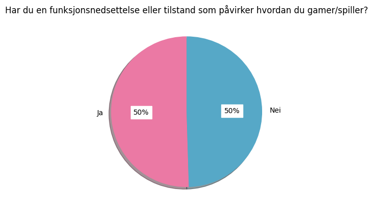

```
                      funksjonsnedsettelse
funksjonsnedsettelse                      
Ja                                      53
Nei                                     52
```

## 300. Beskriv funskjonsnedsettelsen din:

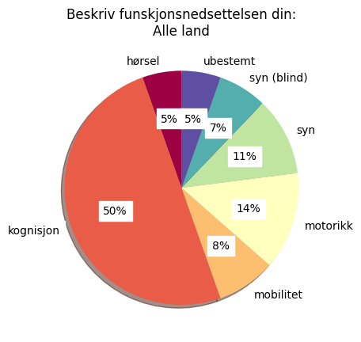

```
                                funksjonsnedsettelse-type-kode
funksjonsnedsettelse-type-kode                                
hørsel                                                       4
kognisjon                                                   37
mobilitet                                                    6
motorikk                                                    10
syn                                                          8
syn (blind)                                                  5
ubestemt                                                     4
```

## 4. Hvor ofte spiller du dataspill?

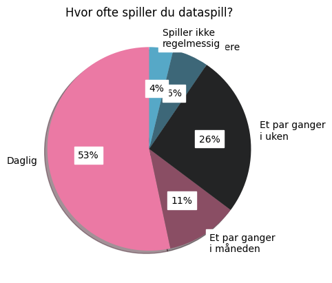

```
                               spillevaner
spillevaner                               
1 - Daglig                              56
2 - Et par ganger\ni uken               27
3 - Et par ganger\ni måneden            12
4 - Sjeldnere                            6
5 - Spiller ikke\nregelmessig            4
```

## 400. Hvor ofte spiller du dataspill?

### Subset Med vs. Uten funksjonsnedsettelse (%)

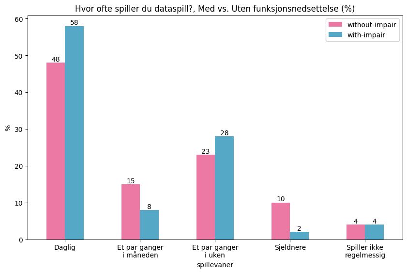

### Subset Uansett funksjonsevne (%)


## 5. Hvilke spillplattformer bruker du mest? (Total #)

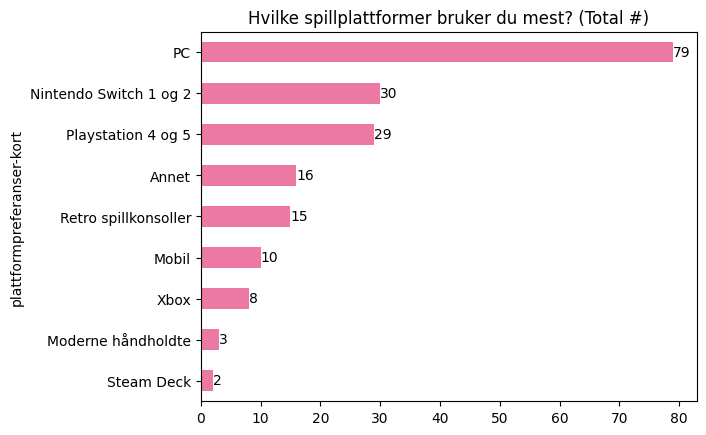

```
                           plattformpreferanser-kort
plattformpreferanser-kort                           
Annet                                             16
Mobil                                             10
Moderne håndholdte                                 3
Nintendo Switch 1 og 2                            30
PC                                                79
Playstation 4 og 5                                29
Retro spillkonsoller                              15
Steam Deck                                         2
Xbox                                               8
```

## 6. Hvilke spillsjangere foretrekker du? (Total #)

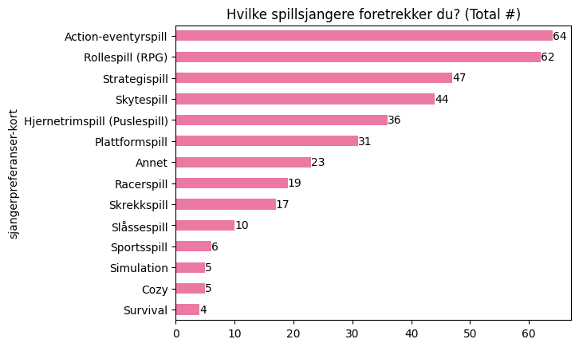

```
                              sjangerpreferanser-kort
sjangerpreferanser-kort                              
Action-eventyrspill                                64
Annet                                              23
Cozy                                                5
Hjernetrimspill (Puslespill)                       36
Plattformspill                                     31
Racerspill                                         19
Rollespill (RPG)                                   62
Simulation                                          5
Skrekkspill                                        17
Skytespill                                         44
Slåssespill                                        10
Sportsspill                                         6
Strategispill                                      47
Survival                                            4
```

## 7. Hvilke spillsjangere skulle du ønske du kunne spille mer, hvis de var bedre tilgjengelige for deg? (Total #)

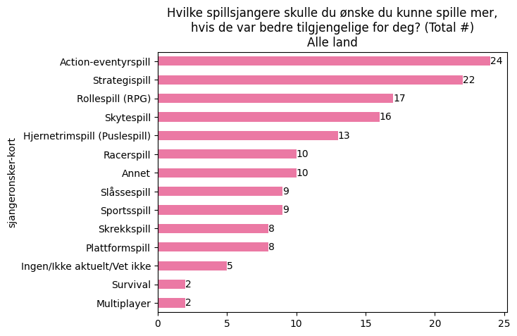

```
                              sjangeronsker-kort
sjangeronsker-kort                              
Action-eventyrspill                           24
Annet                                         10
Hjernetrimspill (Puslespill)                  13
Ingen/Ikke aktuelt/Vet ikke                    5
Multiplayer                                    2
Plattformspill                                 8
Racerspill                                    10
Rollespill (RPG)                              17
Skrekkspill                                    8
Skytespill                                    16
Slåssespill                                    9
Sportsspill                                    9
Strategispill                                 22
Survival                                       2
```

## 8. Hvor ofte opplever du at det er vanskelig å spille med dine behov? (%)

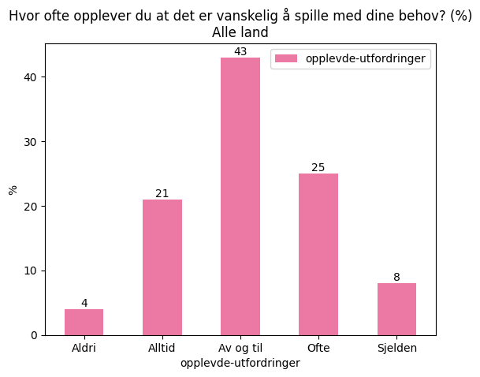


## 9. Hvilke tilgjengelighetsfunksjoner bruker du når du gamer/spiller?

Antall svar: 53

* Lengre tid, motion sickness mode og mods som gjør spillet enklere/automatisert
* Prøver å ikke bruke men bruker nok noe vet ikke hva
* bruker ingen tilgjengelighetsfunksjon selv om jeg kanskje hadde hatt nytte av det
* Skru av blinkende lys, skru av jump-scares, redusere bevegelse på skjermen, skru av vibrering i håndkontroller, skru av høye eller forstyrrende lyder, pause spillet når man leser/åpner inventaret
* Större text stort sett en eneste som er tilgjengelig
* Tekst til tale
* Anti screensickness, autohold isteden for rask trykking, subtitles med stor tekst, autofokus target
* Teksting, tilpasset vanskelighetsgrads, tilpasset fov
* Vanskelighetsgrad, lysgrad, fontstørrelse, teksting. Fargeblindmodus.
* Skrur av blinking og reduserer bevegelse på skjermen
* none, I use external softwares
* Kontroller
* Ingen, bruker headset som passer over høreapparat.
* Lectores de pantalla
* I either use my screen reader or the built in TTS if the game is self-voicing. In games with lots of sounds I'll use audio cues to navigate. In games where that's not an option and if it's availible I'll use pathfinding, which if you're not familiar is where the game will either walk you to locations given in a list or sometimes just tell you which way to go to get somewhere.
* I use a screen reader, audio assistive cues, Navigation assist, and audo aim/lock on.
* I use a screenreader on my PC.
* Skriftstørrelse, motion blur, kamera sensitivitet
* If I play FIFA 99, 2000 or 2002, I select 640x480 resolution for in-game and let nGlide to scale it to Full HD, leaving GUI and player indicators in lower resolution. For NHL 99–2002, I use puck shadow. For shooters, I use a larger sight symbol. For very dark games, I use a program called SetGamma and have auto-scripted it before and after the game executes. I use larger mouse cursor or dark menu themes if they are available.
* Alt som er foran meg
* Reduce Screen Shaking
* visual indicators if available, sound indicators,
* Kontroller med spesielle funksjoner, f.eks turbo
* ?
* Teksting, kanskje noe farge/lysjustering
* fargeblindmodus
* ingen
* Endrer ofte på grafikk for å unngå kvalme/svimmelhet
* Card box for my legs (haha) And hue lights from philips
* At det er satt på easy
* Teksting
* Kontrollersupport. Aim assist (slow-mo, gyro aim, eller auto aim.) Utvidet tid på tidsbegrensninger. Dodge/parry indikator. Button remap. Toggle sprint. Auto-pickup loot. Auto heal. “Hold” alternativ til rask trykking. Field of View. Kamerafølging av. Kameraristing av. Lysblink av. Mute raskt repeterende lyder som klikke-lyder for dialog. Dialoghistorie/logg. Teksting. (Vanskelighetsgrad i mangel på annen tilrettelegging.)
* Ingen
* Fargeblindhet-filter
* Ingen
* Visuelle lydindikatorer
* Vet ikke
* mods
* 1. Zoom 2. Justere lydutrykket i spill (gjøre bakgrunns og forgrunnslyder høyere/lavere). Fysiske: Laptop istedenfor stasjonær.
* Ingen
* Ikke noe særlig, men evt macro i min tastaturs driver slik jeg kan få skrevet strategisetninger mye raskere til e-sportslaget mitt.
* ci
* Night light embedded in Windows
* Nedsatt lysstyrke. Demping av lyd.
* Ingen, klarer ikke å finne de
* Sku ned lysstyrken + bakgrunnsmusikk
* større skrift der mulig
* Begrensninger av tid
* Lav lysstyrke. Invertering av fargene for å få det mørkere. Økt kontrast. Lyden av.
* Forstår ikke
* Ønsker å kunne justere alle ulike deler av lyd, ønsker innstillinger som kan la meg spille i "peaceful mode" så det ikke blir stressende
* große GUI,
* Justerer FOV, motion blur, justerer så jeg heller bruker steam på tv eller spiller konsoll (avstand hjelper) evt mod som endrer first person til third person men dette er ikke alltid optimalt

## 10. Hvilke tilgjengelighetsfunksjoner savner du i spillene du spiller?

Antall svar: 53

* 3.person view litt på avstand og mindre bevegelse på kamera i bevegelse
* aim assist er en fin ting for meg
* vet ikke
* Skru av tidsbegrensning. Skru av stressende elementer som gir økning av puls. Ting for å hjelpe hukommelse f.eks kart over hvor du har gått, automatisk oppdatert logg (à la Outer Wilds), og innebygd notatbok
* Audiobeskrivelse og muligheter for å gjøre å spille motorisk enklere
* Alt
* Repeat hints uten å restarte mission, tale til text i chat, jeg er for treig til å skrive, og hvis jeg som kvinne snakker blir jeg herset ofte. Fler autolock og 3d person muligheter
* Autoaiming
* Noen spill kan man ikke justere vanskelighetsgrad.
* Mulighet til å spille med både mus og kontroller samtidig, istedenfor tastatur, så man f.eks kan bevege seg med joystick på kontroller med en hånd, og se seg rundt og klikke på ting med mus i den andre hånda.
* more things that you could do with mouse clicking
* Bedre støtte for kontroller
* Ingen
* Bueno, la función que echaría de menos es que.a veces la voz se pierde en los juegos, decir que la voz no se mantiene muy bien.
* I'm not really sure how to answer this one but when I have to use pathfinding systems I sometimes find myself thinking it would sure be nice to have audio cues so I can navigate there myself like everyone else instead of the computer doing it.
* all the ones I just mentioned.
* not accessible eough for the screenreader
* Skriftstørrelse, grafiske innstillinger som motion blur
* Basically, when games moved from MS-DOS to Windows, font sizes did not retain, but became smaller, usually a lot. I miss larger font sizes the most. Games that have white or very bright menu backgrounds, should also offer dark option as well. It is also easier to navigate, if a player can select keyboard,mouse or gamepad control in menus as well. Especially, if mouse cursors are very small, mouse-only menus are often hard to navigate.
* Litt enkle instrukser
* none
* visual indicators if available, sound indicators,
* -
* Hyper fokus
* Ingen for min del
* Noen spill kan være overveldende å sette seg inn i mentalt, når man har begrenset kognitiv kapasitet. (ikke evne, men kapasitet)
* ingen
* Kommer ikke på noe
* More light settings in games. They ar enormally just adjusted for epilepsy, not light sensitive.
* God teksting
* Teksting
* Aim assist (slow-mo, gyro aim, eller auto aim.) Utvidet tid på tidsbegrensninger. Dodge/parry indikator. Overstimuleringsfilter (redusert repeterende lyder, alarmer etc.) “Hold“ for rask klikking. Dialoghistorie/logg.
* Ingen
* Ingen
* Takke nei til oppdateringer ettersom de endrer spille veldig mye ofte.
* Like muligheter til å justere kvaliteten på grafikken når en spiller på konsoll, slik pc-spillere ofte har
* Vet ikke
* none
* Se punkt 11 og 8. Grafikkinnstillinger og lyd er like viktige for meg. Noen ganger må "musikk" og "bakgrunnssambience" skrues ned. + Undertekst når karakterer (NPC) og andre ekte spillere sier noe hvis jeg ikke klarer å lytte/får vondt av lyd.
* Vet ikke
* Lyd til tekst, slik vi kan oppfatte de som bruker mikrofon. Lydssignaler som for eksempel Fortnite har, som viser hvor fotspor, kister og slikt kommer fra. En mulighet for oss til å kommunisere effektiv uten å bruke mikrofon/kamera.
* visuell lyd
* Light adjustment
* Meir ergonomiske kontroller. Mulighet å velge «dempet sanseintrykk» for dårlige dager. Der lyd, lys og annet som kan bli for mye for sansene blir dempet/minsket.
* At spillhastigheten kunne blitt stilt inn slik at det ble mere i mitt tempo da jeg har senere reaksjonsevne
* Vet ikke
* mulighet for større skrift i spillene, samt endre på hvor store ting er på skermen
* Tilrettelagt for epilepsi fra produsent. Tenker da på blink å andre kjente faktorer med tanke på epilepsi.
* Økt kontrast.
* Forstår ikke
* FFX jeg ønsker å kunne slå av musikk eller ulike lyder
* Schwierigkeitsgrad, Click-to-move, weniger Gegner, Quicktime-Events aus, Mausbeschleunigung aus,
* At det ikke er lettere å unngå first person eller justere det for de med motion sickness uten å spesifikt søke etter optimale innstillinger eller unngå åspille

## 11. Har du brukt tilgjengelighetsfunksjoner som ikke var laget for dine behov, men som likevel hjalp deg?

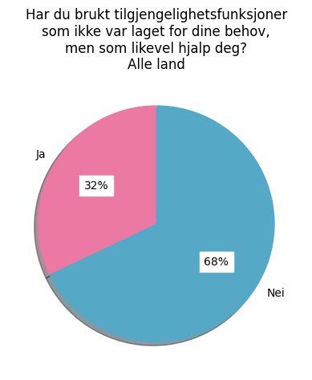

```
                                        personlig-opplevd-curb-cut_with-impair
personlig-opplevd-curb-cut_with-impair                                        
Ja                                                                          17
Nei                                                                         36
```

## 12. Hvilke funksjoner gjaldt det?

Antall svar: 17

* Masse forskjellig, vanskelig å spesifisere
* Muligheter for å forstørre teksten blant annet å spille for barn skulle gjerne også hatt det slik at teksten blir lest opp
* Fargeblindmodus hjelper ved puslespill sel  om ikke er fargeblind
* Teksting
* Alle tidligere nevnt. Teknisk ikke sett laget for meg, men hjalp.
* Motoriske som å endre button mashing til single tap eller hold
* See 11. I always try to be creative.
* Reduce Screen Shaking
* visual indicators, sound indicators, i usually use what is a available,trying them out to see what i like better, except for the color blind mode
* Teksting
* lyd på skjerm
* Bruker en funksjon som viser lydene visuellt på skytespill
* Teksting, retnings/oppmerksomhetsindikator (hvilken retning lyder eller angrep kommer fra), deaktivere lysblinking.
* Visuelle lydindikatorer
* 1. Undertekst. 2 Epilesi: " flicker-free options or effects filters." 3. Chatte-muligheter i spill når "alle andre" virker til å være i "en voice chat" så formulrerer jeg meg bedre i tekstform og bruker denne.
* fargeblind modus fordi ting ser bedre ut i de tilfellene selv om jeg ikke er fargeblind😂
* Größere GUI (Guildwars), Passive Gegner (Valheim), Pause zum Spielzug machen (FTL, Mini Metro, Mini Motorways)

## 13. Har du lagt merke til at funksjoner laget for én gruppe brukes av andre spillere?

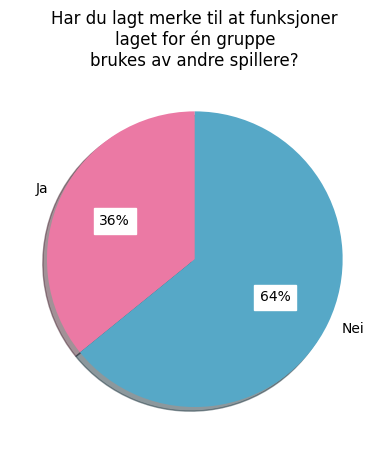

```
                                       generell-opplevd-curb-cut_with-impair
generell-opplevd-curb-cut_with-impair                                       
Ja                                                                        19
Nei                                                                       34
```

## 14. Hvilke funksjoner har du lagt merke til?

Antall svar: 19

* Tekst på skjermen nå helt vanlig men ble opprinnelig laget for hørselshemmede
* Teksting, tilpasset vanskelighetsgrad
* Fargeblindmodus gir noen ganger fordeler i kompetitivt spill.
* For fargeblinde og for dårlig syn
* He notado, por lo menos en los juegos que ustedes tienen, muchas mejoras de accesibilidad que ningún otro juego tiene.
* Skriftstørrelse og motoriske innstillinger
* visual indicators, sound indicators
* Kontrast
* Button mapping
* lyd på skjerm
* Feks løsninger for fargeblinde brukes for å gjøre spillet enklere/greiere å spille
* I know light settings would help lots of players
* Teksting, toggles, button remap, aim assist
* Mods
* Visuelle lydindikatorer
* Se punkt 14, men også "map options" som feks viser en pil i feks rollespill som forteller hvor du skal gå.
* Fargeblinde farger og den fortnite lydsvarsler.
* visuell lyd i fortnite
* Er personlig glad i subtitles feks.

## 15. Tenker du på tilgjengelighet som noe som angår deg?

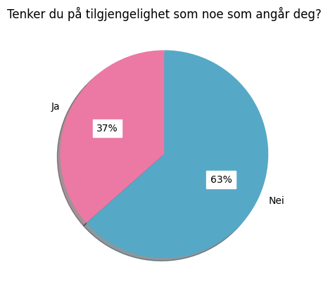

```
                              holdning-til-tilgjengelighet
holdning-til-tilgjengelighet                              
Ja                                                      19
Nei                                                     33
```

## 16. Har du lagt merke til tilgjengelighetsinnstillinger eller -funskjoner i spill du har spilt?

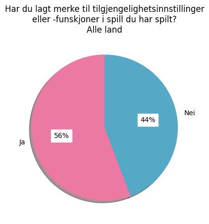

```
                                          kjennskap-til-tilgjengelighetsfunksjoner
kjennskap-til-tilgjengelighetsfunksjoner                                          
Ja                                                                              29
Nei                                                                             23
```

## 17. Hvilke funksjoner har du lagt merke til?

Antall svar: 27

* En la rapidez de respuesta o la sensibilidad del joystick
* contrast, transparency
* En los de daltonismo, por curiosidad
* text-to-speech features, high contrast features
* Brightness, Last of Us 2 had a whole lot of options for visibility.
* font size, colors / contrast
* Colors adapted to colorblindness, subtitles
* Colorblind settings, subtitles
* Tekst, evnen til å pause eller sakke tiden, farge code tekst
* hjelp til fargeblinde, og større tekst.
* Tale for tekst og kontrast
* Teksting
* Colorblind modes, general subtitles
* Kontrast/lys, fargeblind, bokstavstørrelse, POV, osv.
* Tekst eller lydstøtte spill (eks at det viser hvor skyting kommercfra i retning i fortnite
* Color blind settings, Interface size adjustable,
* Har ikke sett så nøye på det, men har bladd forbi "tilgjengelighets funksjoner" på mange spill, og tenkt 'hmm lurer på hvordan det hjelper og håper det gjør det". Det er også greit at de fleste spill kan bytte knappfunkjoner, da er det vel lettere å tilpasse sin egne vaner og funksjn/evner
* Teksting, tekst/UI-størrelse, farge/kontrast-korrigering, vanskelighetsgrad, knappekonfigurering, tilpasning av enkeltmeksnsimer (f.eks. Slow-mo i Celeste), mm
* Higher contrast
* Fargeblind moduser og endring av UI størrelse
* Justering av UI. Justering av individuelle innstillinger som påvirker spillbarhet, fiende aggresjon, helse, skade man gjør o.l.
* veldig mange.
* Teksting og fargejustering
* Opplesning, fargeblindhet, skru av blinkende lys
* Jeg har lagt merke til innstillinger for de som er fargeblinde, slik at man kan endre fargenyansene, eller hva det kalles. Vil også argumentere for at "aim assist" som er ment for kontrollere også kan være til hjelp for de med dårlige reflekser eller hånd funksjoner, men den er jo likevel standard pga at den er ment for kontrollere.
* Fargesettinger, større font, automasjonsfunksjoner
* Opplyser angående epilepsi

## 18. Er du nysgjerrig på tilgjengelighetsfunksjoner når du ser dem i spill eller på plattformen du bruker?

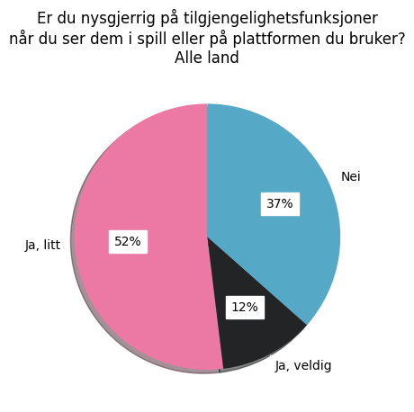

```
                                          interesse-for-tilgjengelighetsfunksjoner
interesse-for-tilgjengelighetsfunksjoner                                          
Ja, litt                                                                        27
Ja, veldig                                                                       6
Nei                                                                             19
```

## 19. Har du noen gang brukt slike funksjoner selv – for eksempel teksting, fargejustering, zoom, kontrolltilpasning eller assistansemoduser?


```
                                                   bruk-av-tilgjengelighetsfunksjoner_without-impair
bruk-av-tilgjengelighetsfunksjoner_without-impair                                                   
Ja                                                                                                27
Nei                                                                                               25
```

## 20. Hvilke tilgjengelighetsfunksjoner har du brukt?

Antall svar: 27

* Reducir la sensibilidad del control, volumen de la música/controles
* Personalización de controles
* Subtítulos y el ajuste de daltonismo
* subtitles, control, high contrast
* Subtitles
* Control customisation, brightness/color adjustments, subtitles if sound is an issue.
* subtitles color and size, contrast
* Color adjustment, aplha
* Subtitles
* Subtitles
* Tekst, evnen til å pause eller sakke tiden, farge code tekst
* Bruker for hørsel så jeg får opp tegn på skjermen hvor skyting og gåing skjer
* Kontrast
* Teksting
* Tekst og signalfunlsjon (Fortine)
* Har ikke tenkt på at lys farger og zoom er assistent modus😅... men bruker å dempe lys om det går and og skru litt opp skriftstørrelse
* Teksting, knappejusteringer
* Zoom, subtitles
* subtitles
* Justering av UI for å gjøre det mer lesbart
* Alle
* Teksting (for vokale dialoger i spill, hvis dette telles)
* Tekst og elementer som viser at noen er nær osv som i Fortnite.
* Tekst og litt mørkere lys
* Automatisk "item-pickup" i Last of Us 2, fargejustering i League of Legends
* Alt nødvendig
* Stemme skriving

## 21. Hva fikk deg til å bruke disse funksjonene?

Antall svar: 27

* No estoy acostumbrada a jugar y prefiero que vaya más lento para poder controlarlo mejor
* Buscas más cómodidad al jugar
* Subtítulos por el idioma, los de daltonismo por curiosidad
* avoid eye strain, avoid having to buy complex game setup to be able to play the game
* To help understanding languages that are not my mother tongue
* Curiosity (control customisation), ease of play (sound/visuals)
* Hard to see, tiring
* It felt more natural and easier to play
* To have dialogues in original version and subtitles in my language
* My reading comprehension is better than my reading comprehension
* Dysleksi og apd
* Hjelp for å lokalisere fiender. Da jeg ikke klarer å høre hvor de er
* Få bort gjennomsiktighet som gjør at jeg sliter med å lese
* Det er enklere å få med seg hva som blir sagt
* Lettere for meg å henge på
* Lys ømfintlig og ser litt dårlig (liten tekst)
* Teksting: ofte utilstrekkelig lydmiks til å skille ut dialog. Knappejustering pga preferanser og/eller forbigående smerte i enkelte ledd
* Sometimes the text is too small to read or the music swamps the dialogue
* quicker to read subtitles than to wait for a character to finish speaking
* Liten tekst
* Fordi det er et verktøy som gjør spillet morsommerer når det er vanskelig spill, ellers bruker jeg de ikke. Det skal være utofrdrenede, men å få tips til hvor man skal gå eller slippe gjøre kombinasjoner som er ekstremt vanskelig om man ikke spiller mer enn 1-2 timer om dagen gjør det til et nyttig hjelpemiddel
* Bruker den for å få med dialoger og viktig informasjon i spill der  karakterene ofte har stemmer. Til tross for at jeg er hørende kan man ikke alltid få med seg det som blir sagt
* Tilpasset mitt hørselstap
* For å se bedre med litt mørk lys og litt større tekst
* Gjør livet enklere, ser penere ut
* Grad av nøyaktighet
* Gjøre skriving lettere

## 22. Har du opplevd at funksjoner laget for tilgjengelighet har forbedret din egen spillopplevelse?

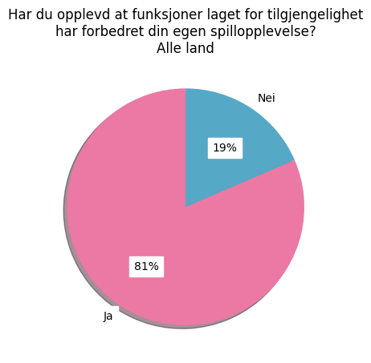

```
                                           personlig-opplevd-curb-cut_without-impair
personlig-opplevd-curb-cut_without-impair                                           
Ja                                                                                22
Nei                                                                                5
```

## 23. Har du eksempler på funksjoner der dette har vært tydelig?

Antall svar: 22

* Poder cambiar los controles
* I understood what the quests are about :D
* Subtitles
* Adjusting brightness or colour palettes to make things easier to see, more enjoyable experience
* change font size and color
* Alpha - some enemies were more visible, the animation was "sharper"
* Subtitles
* Better comprehension of dialogs
* Tekst, evnen til å pause eller sakke tiden, farge code tekst
* Tegn på skjermen hvis folk går eller løper. Og skytetrening  fra hvilken retning
* Samme som nevnt over. Få bort gjennomsiktighet
* Jeg får med meg mer i spillet av at det er tekstet
* .
* Skru opp og ned størrelse på tekst. Bytte knapper så abyx og trekant sirkel osv er på riktig plass i forhold til hva jeg er vant med. Men kan tilpasse meg å lære at 'på det spillet er hopp venstre og ikke oppe osv)
* Se pkt 14
* When text is too small or when the soundtrack is too muffled
* quicker to read subtitles than to wait for a character to finish speaking
* Fordi det er et verktøy som gjør spillet morsommerer når det er vanskelig spill, ellers bruker jeg de ikke. Det skal være utofrdrenede, men å få tips til hvor man skal gå eller slippe gjøre kombinasjoner som er ekstremt vanskelig om man ikke spiller mer enn 1-2 timer om dagen gjør det til et nyttig hjelpemiddel
* Mulighet til å ha teksting på dialoger da dette bidrar til å få med alle detaljene som dårlig lyd kunne ødelagt
* Et slags sirkel som viser hvor i retning det skyter eller hvor nær fiender er nær deg osv som på Fortnite
* Audio visuell for eksempel sirkel som viser symboler lyden kommer fra
* Automatisk "item-pickup" var veldig hjelpsomt slik at man slipper å trykke A fire hundre ganger i minuttet mens man spiller